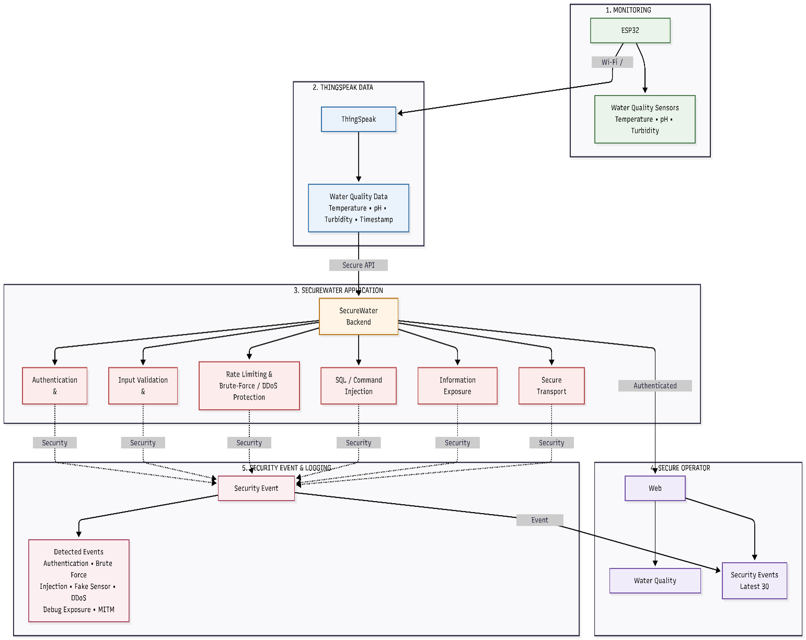
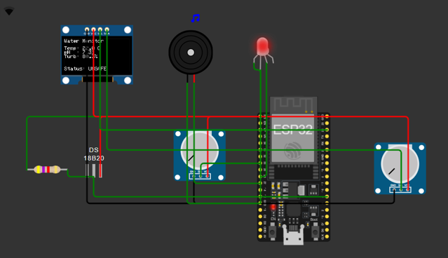
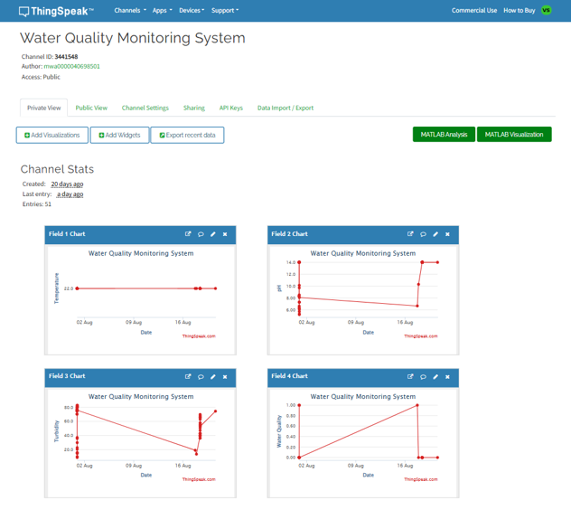
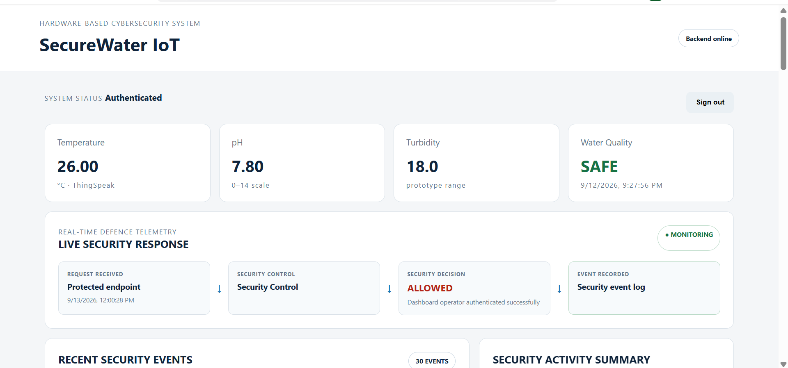
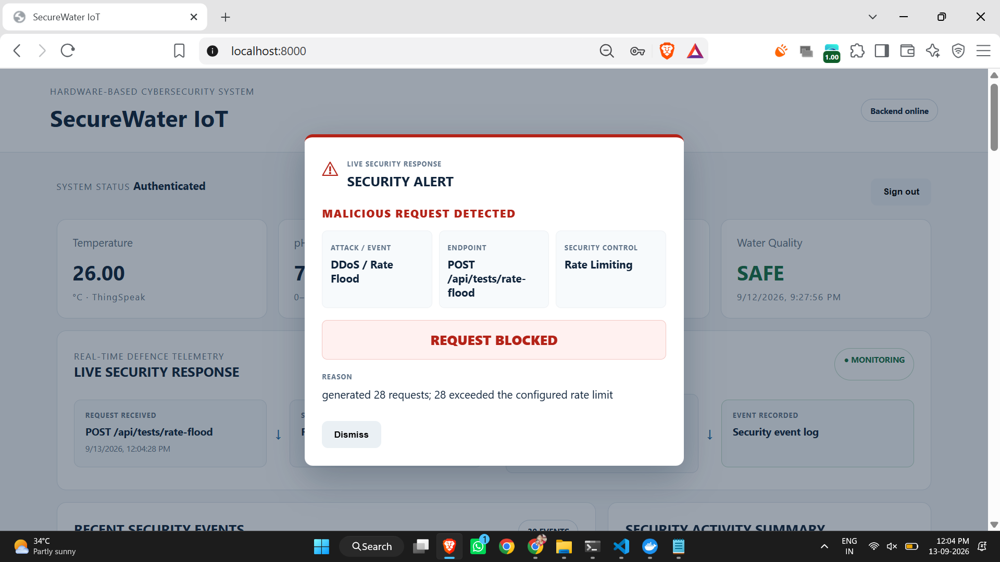

# SecureWater IoT

## Cybersecurity for Smart Water Infrastructure

### Introduction

**SecureWater IoT** is an IoT-based smart water-quality monitoring and cybersecurity project. The project combines an ESP32-based monitoring prototype, ThingSpeak cloud communication, a FastAPI backend, and a web-based dashboard to demonstrate secure remote monitoring of an IoT water system.

The system monitors **temperature, pH and turbidity**, determines the overall water-quality condition, displays readings locally, and transmits the data to ThingSpeak. The cybersecurity extension protects the remote monitoring application through authentication, input validation, rate limiting, injection protection and other application-level security controls.

\---

## Project Description

The project was developed in two connected parts:

1. **IoT Water Monitoring** — ESP32-based sensing, local display/alerts and ThingSpeak cloud communication.
2. **Cybersecurity Layer** — secure backend APIs, authentication, security controls, event logging and controlled cybersecurity testing.

The project was validated using **Wokwi simulation** for the ESP32 hardware and sensor workflow before integration with the cloud and web application.

The implementation demonstrates the integration of **IoT, embedded systems, cloud communication, backend development, web technologies and cybersecurity** in a single monitoring system.

\---

## Architecture

The architecture diagram illustrates the complete system from the physical sensing layer through the ESP32 and ThingSpeak cloud to the secured application and monitoring dashboard.

The main components represented in the architecture are:

* Water-quality sensors
* ESP32 microcontroller
* Local OLED/alert system
* Wi-Fi communication
* ThingSpeak cloud platform
* FastAPI backend
* Security controls and event logging
* SecureWater IoT web dashboard

The architecture demonstrates how sensor data moves from the physical monitoring system into the cloud and is subsequently accessed through a protected application layer.

### Architecture Diagram



\---

## Hardware

The hardware prototype uses an **ESP32** as the central controller.

|Component|Purpose|
|-|-|
|ESP32|Sensor processing, Wi-Fi communication and system control|
|DS18B20|Temperature measurement|
|pH Sensor|pH measurement|
|Turbidity Sensor|Turbidity measurement|
|SSD1306 OLED|Local display of readings and water-quality status|
|Green LED|SAFE indication|
|Red LED|UNSAFE indication|
|Buzzer|Audible warning for unsafe conditions|

The ESP32 reads the sensor values, processes the measurements, determines the water-quality status and controls the local display and alert indicators.

### Hardware Diagram



\---

## Cloud Integration — ThingSpeak

**ThingSpeak** is used as the cloud platform for receiving, storing and visualising the sensor measurements.

|ThingSpeak Field|Data|
|-|-|
|Field 1|Temperature|
|Field 2|pH|
|Field 3|Turbidity|
|Field 4|Water Quality|

The ESP32 sends the processed measurements to ThingSpeak through Wi-Fi. The platform provides timestamped records and graphical visualisation of the monitored values.

### ThingSpeak Dashboard



\---

## Secure Monitoring Dashboard

The **SecureWater IoT dashboard** provides the remote monitoring and cybersecurity interface.

The dashboard displays the current water-quality readings together with the application's security state. The FastAPI backend provides protected API endpoints and applies the implemented security controls before processing protected requests.

The dashboard also provides security monitoring capabilities, including security-event information and real-time visibility into security decisions.

### Dashboard




\---

## Cybersecurity Test Capabilities

The secured application was validated against seven controlled cybersecurity scenarios:

|Test|Security Capability|
|-|-|
|Unauthorised Access|Authentication and protected API access|
|DDoS / Rate Flood|Rate limiting and excessive-request control|
|Fake Sensor Injection|Input validation and sensor-data protection|
|Debug Exposure|Protection against unnecessary internal information disclosure|
|SQL / Command Injection|Malicious-input detection and rejection|
|Brute-Force Authentication|Protection against repeated failed login attempts|
|MITM / Plaintext Transmission|Secure transport policy for protected communication|

The tests are performed in a controlled local environment. Each scenario demonstrates how the implemented security controls respond to a specific threat condition.

The project also provides security observability through the dashboard, allowing security decisions and recorded events to be viewed alongside the monitoring system.

\---

## Setup

### Requirements

* Python 3.x
* Docker Desktop
* Wokwi or ESP32 development environment
* ThingSpeak account/channel
* Modern web browser

### Backend

Install dependencies:

```bash
pip install -r backend/requirements.txt
```

Run the application:

```bash
uvicorn backend.app.main:app --host 0.0.0.0 --port 8000
```

Or use Docker Compose:

```bash
docker compose up --build
```

Open the dashboard:

```text
http://localhost:8000
```

Configuration values and API credentials should be stored in a local `.env` file and should not be committed to a public repository.

\---

## Technologies

* **Embedded:** ESP32, DS18B20, pH Sensor, Turbidity Sensor, SSD1306 OLED, Wokwi
* **Cloud:** ThingSpeak, Wi-Fi, HTTP
* **Backend:** Python, FastAPI, Uvicorn
* **Frontend:** HTML, CSS, JavaScript
* **Security:** Authentication, Input Validation, Rate Limiting, Injection Protection, Brute-Force Protection, Debug Exposure Protection, Secure Transport Policy, Security Event Logging
* **Deployment:** Docker, Docker Compose

\---

## Author

**Vikas Narlakanti**

Email: **vikassagar891@gmail.com**

**September 2026**

